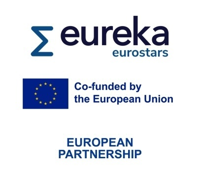

!!! info inline end ""

    

# SPARQL-ML - Machine Learning for SPARQL Query Optimization over Centralized and Distributed RDF Knowledge Graphs

The SPARQL-ML project develops AI and machine-learning-based generic approaches for optimized query processing over large RDF Knowledge Graphs to facilitate the development of high-performance centralized and distributed data storage solutions.
The final output will be a set of W3C-standard-conformant tools that implement Optimized SPARQL query execution on top of centralized and federated RDF Knowledge Graphs.

## Funding

!!! info inline end ""

    
    

This project receives funding from of the [Eureka Eurostars programme](https://eurekanetwork.org/programmes/eurostars/) (Project ID: 5736), which is part of the [European Partnership on Innovative SMEs](https://eurekanetwork.org/about-us/european-partnership-on-innovative-smes/), in cooperation with the [German Federal Ministry of Education and Research (BMBF)](https://www.bmbf.de/).

## Latest News

!!! info "2024-11-13 - Kick-off Meeting"

    Today, we met in Leipzig to practically kick-off our project.

!!! info "2024-10-21 - Funding approved"

    We are happy to announce that the first partners got the funding approval.
    We are starting to organize our kick-off meeting now.

!!! info "2024-08-26 - Website online 🚀"

    Our new domain sparql-ml.eu is registered and a first page is online.

