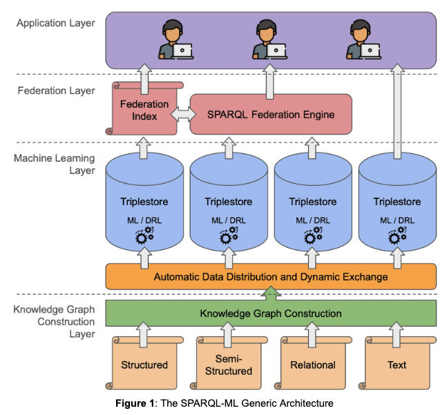

# ::material-compass-outline:: Overview

## Introduction

The emergence of large RDF Knowledge Graphs, such as the 15 billion triples in the Wikidata Knowledge Graph used by Google's search engine and the 148 billion triples in UniProt, has presented a considerable challenge in efficiently querying these vast repositories.
Traditional query optimization methods have not fully explored the potential of modern deep learning techniques for scalable execution of SPARQL queries over massive and distributed RDF Knowledge Graphs.
The current landscape highlights a growing necessity to explore contemporary AI and machine learning-based solutions to enhance SPARQL query processing over both centralized and distributed RDF Knowledge Graphs.
As data volumes continue to increase and become more widely distributed, organizations face challenges in optimizing the use of their data assets.

Existing distributed solutions often cater to centralized storage or static data distribution, resulting in suboptimal query performance.
Consequently, there is a pressing demand for advanced data distribution strategies and federated query engines capable of handling substantial amounts of data with high efficiency.
Our objective is to elevate data management to a new standard, capitalizing on high-performance, scalability, and efficient handling of semantic data to meet the evolving demands of the market.

## Architecture

The preliminary architecture for SPARQL-ML is shown in the Figure below.
Starting from the bottom, we will first construct Knowledge Graphs (KGs) using the Resource Description Framework format (RDF), a W3C standard for the representation of knowledge on the Web.
The source data will be data which is currently missing formal semantics and exists in structured, semi-structured or unstructured formats.
We then distribute the resulting RDF KGs among different data storage solutions, i.e., triple stores with public SPARQL endpoints, thus allowing users to query them by means of SPARQL, the W3C standard for querying RDF data.
The triple stores will also host the data from the project use-cases which are already represented as RDF KGs.
The triple stores will be able to exchange the data dynamically, to exploit data locality for maximizing and balancing the amount of computation in a single storage solution.
The triple stores will use machine learning (ML) techniques and deep reinforcement learning (DRL) in order to optimize the incoming SPARQL queries, for improved performance.
The user can query the distributed triple stores directly or via the SPARQL federation engine, which makes use of the federation index which is calculated beforehand, based on the profile of each triple store.

The architecture consists of 4 main layers:

### Knowledge Graph Construction Layer

In this layer we will convert data relevant to the business use cases into Knowledge Graphs (KGs), based on the Resource Description Framework format (RDF), a W3C standard for the representation of knowledge on the Web.
The large number of datasets required by the use cases will each be hosted in triple stores, thus allowing the users to query them by means of SPARQL, the W3C standard for querying RDF data.
The conversion will be enabled by the integration between the Corporate Memory Enterprise Knowledge Graph platform and Tentris as a triple store.
The conversion will encompass structured, semi-structured and unstructured data, of interest for the project use-cases.

### Machine Learning Layer

In this layer we will use our existing solutions for automatic data distribution between storage nodes (in a clustered version of the data storage solution) and for dynamic data exchange between the nodes, based on usage load information.
This dynamic exchange of data can be a deletion, an insertion or the insertion of a replicated chunk of data from another storage solution.
The decision of dynamic exchange will be mostly based on the monitoring of the storage solutions, in particular on the federated queries that were issued to the distributed storage solution.

Each triple store will implement an ML-based solution for SPARQL query optimization of the incoming queries.
More specifically, we aim to apply deep reinforcement learning (DRL) techniques to optimize the SPARQL query processing in triple stores, motivated by the improved performance of using DRL in optimizing relational database queries.
The main goal of this component will be to select an optimal join-order in the query plan that leads to significant performance improvement in terms of query execution time.
The proposed optimization methods will be implemented in Tentris, a well-known state-of-the-art triple store for SPARQL query processing, freely available from the DICE research group at University of Paderborn.
In addition, OpenLink will also adopt the proposed methods in their Virtuoso RDF Quad Store.
We will use both real-world and synthetic SPARQL benchmarks to evaluate the proposed optimization algorithms to be used in this layer.

### Federation Layer

In this layer, we will use our SPARQL query federation engine developed in a previous research project (3DFed).
The join ordering of the plans it generates is based on an estimation of the cardinality of the triple patterns and the joins contained in the input query.
The decision between the join implementation to use (bind or symmetric hash join) is based on the join cost estimation function it implements.
In addition, it will implement means to keep its index up-to-date based on regular intervals as well as at fixed times.

### Application Layer 

In this layer, we will provide user friendly interfaces for querying the distributed data hosted by different data storage solutions.

