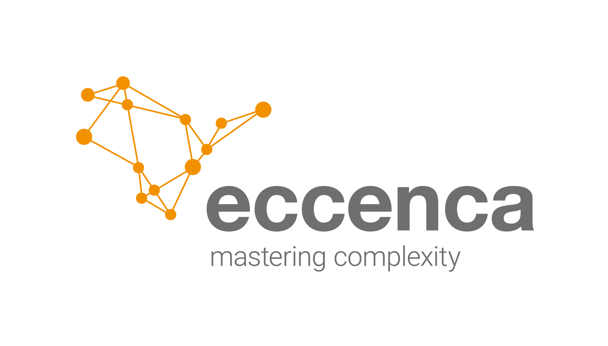
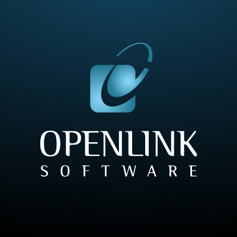
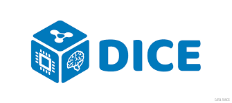

# ::material-account-group:: Partners

## [eccenca](https://eccenca.com)

!!! info inline end ""

    

Headquarted in Leipzig, Germany, eccenca GmbH was founded in 2013 as a spin-off from Leipzig University’s Institute for Applied Informatics.

[eccenca Corporate Memory](https://documentation.eccenca.com) provides a multi-disciplinary integrative platform for managing rules, constraints, capabilities, configurations and data in a single application.
Overcoming the limitations of traditional, application centric (meta) data management models, its semantic knowledge graph is both highly extensible, integrative as well as interpretable both by machines and business users.

## [OpenLink](https://www.openlinksw.com/)

!!! info inline end ""

    

OpenLink Software is at the cutting-edge of data-centric technological innovation, offering secure, high-performance, and platform-independent solutions for data access, integration, virtualization, and management.
Grounded in open standards, our products offer unrivaled freedom and cost-effectiveness in the pursuit of data-driven agility.

Virtuoso Universal Server is a modern enterprise-grade platform for data access, virtualization, integration and multi-model relational database management (SQL Tables and/or RDF Statement Graphs).

## [Paderborn University](https://dice-research.org/)

!!! info inline end ""

    

The [DICE group](https://dice-research.org/) at [Paderborn University](https://www.uni-paderborn.de/) is dedicated to research at the interfaces between humans, machines and data.
This includes in particular the extraction, integration, querying and use of knowledge graphs in all forms.

